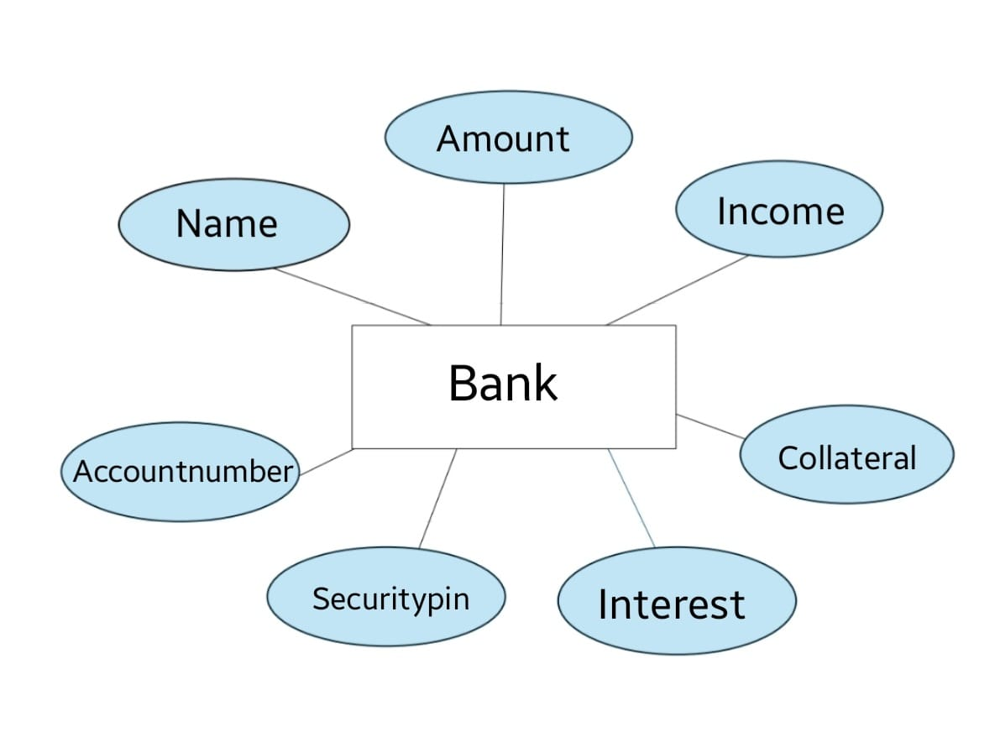

# Ex02 Django ORM Web Application

## Date: 22.10.2024

## AIM
To develop a Django application to store and retrieve data from a bank loan database using Object Relational Mapping(ORM).


## ENTITY RELATIONSHIP DIAGRAM


 


## DESIGN STEPS

### STEP 1:
Clone the problem from GitHub

### STEP 2:
Create a new app in Django project

### STEP 3:
Enter the code for admin.py and models.py

### STEP 4:
Execute Django admin and create details for 10 books

## PROGRAM
 ```
 from django.db import models
from django.contrib import admin
class Bank (models.Model):
 Name=models.CharField(max_length=25)
 Amount=models.IntegerField()
 Income=models.IntegerField()
 Accountnumber=models.IntegerField(primary_key="Accountnumber")
 Securitypin=models.IntegerField()
 Interest=models.IntegerField()
 Collateral=models.CharField(max_length=30)

class BankAdmin(admin.ModelAdmin):
 list_display=('Name','Amount','Income','Accountnumber','Securitypin','Interest','Collateral')

from django.contrib import admin
from .models import Bank,BankAdmin
admin.site.register(Bank,BankAdmin)

```


## OUTPUT


## RESULT
Thus the program for creating a database using ORM hass been executed successfully

